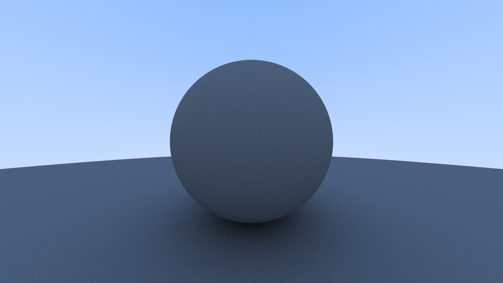

# ray-tracer-rs
Physically Based Renderer written in Rust, based on the book series *"Ray Tracing in One Weekend"* by Peter Shirley.

---

## Progress Tracker

### Latest Render

### Ray Tracing in One Weekend [[1]](#references)
- [x] 1 Overview
- [x] 2 Output an Image
- [x] 3 The vec3 Class
- [x] 4 Rays, a Simple Camera, and Background
- [x] 5 Adding a Sphere
- [x] 6 Surface Normals and Multiple Objects
- [x] 7 Moving Camera Code Into Its Own Class
- [x] 8 Antialiasing
- [x] 9 Diffuse Materials
- [ ] 10 Metal
- [ ] 11 Dielectrics
- [ ] 12 Positionable Camera
- [ ] 13 Defocus Blur
- [ ] 14 Where Next?

### Ray Tracing: The Next Week [[2]](#references)
- [ ] 1 Overview
- [ ] 2 Motion Blur
- [ ] 3 Bounding Volume Hierarchies
- [ ] 4 Texture Mapping
- [ ] 5 Perlin Noise
- [ ] 6 Quadrilaterals
- [ ] 7 Lights
- [ ] 8 Instances
- [ ] 9 Volumes
- [ ] 10 A Scene Testing All New Features

### Ray Tracing: The Rest of Your Life [[3]](#references)
- [ ] 1 Overview
- [ ] 2 A Simple Monte Carlo Program
- [ ] 3 One Dimensional Monte Carlo Integration
- [ ] 4 Monte Carlo Integration on the Sphere of Directions
- [ ] 5 Light Scattering
- [ ] 6 Playing with Importance Sampling
- [ ] 7 Generating Random Directions
- [ ] 8 Orthonormal Bases
- [ ] 9 Sampling Lights Directly
- [ ] 10 Mixture Densities
- [ ] 11 Some Architectural Decisions
- [ ] 12 Cleaning Up PDF Management

---

### References

1. [_Ray Tracing in One Weekend_](https://raytracing.github.io/books/RayTracingInOneWeekend.html)
2. [_Ray Tracing: The Next Week_](https://raytracing.github.io/books/RayTracingTheNextWeek.html)
3. [_Ray Tracing: The Rest of Your Life_](https://raytracing.github.io/books/RayTracingTheRestOfYourLife.html)